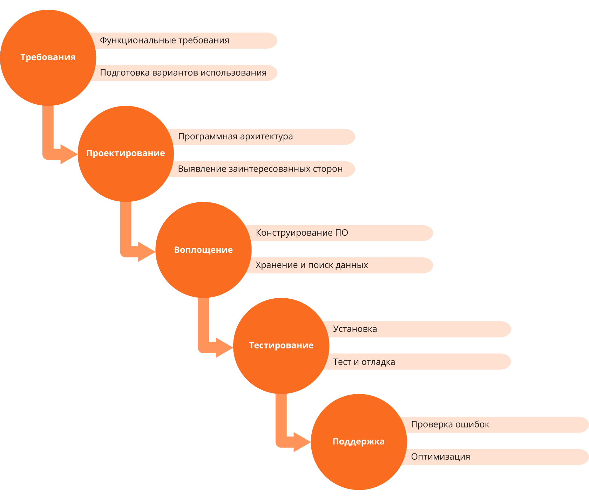
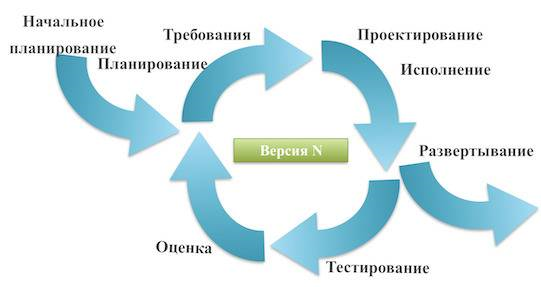
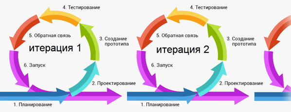
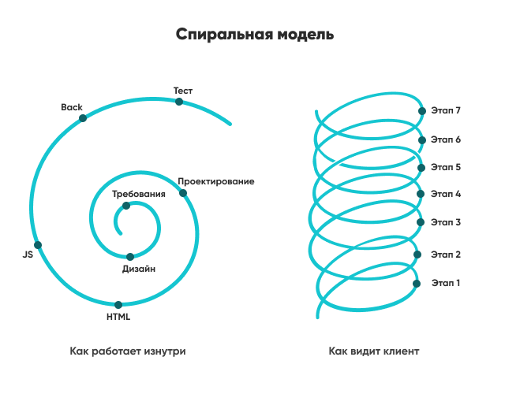
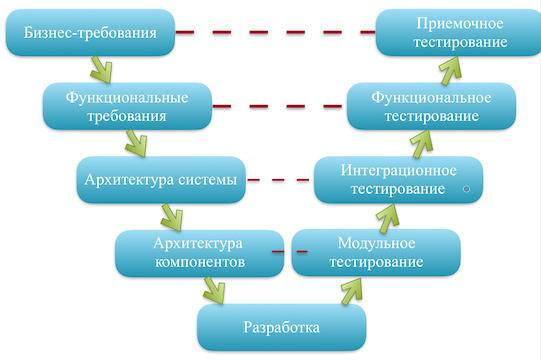
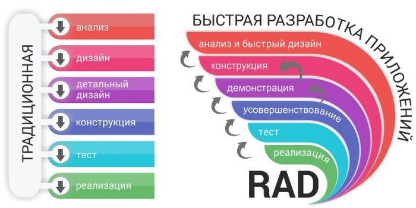

## Методологии разработки ПО

У каждого продукта есть жизненный цикл. 

**Жизненный цикл** - это этапы, через которые проходит вся разработка данного продукта, начиная с мысли о создании данного продукта и принятия решений. Когда мы решили сделать сайт или приложение для кого либо - жизненный цикл продукта уже начался.

Что происходит дальше? 

Далее проводится подготовка, делается анализ, изучается, как этот продукт можно получить. Когда становится понятно, что мы хотим получить в итоге, нужно решить, как это сделать. На этапе проектирования (2 этап) идея формируется в план действий, подбирается стек технологий, и выбираются методологии разработки программного обеспечения.

**Методология разработки ПO** - это подход, при помощи которого будет разрабатываться продукт. И от выбора этого подхода зависит качество конечного продукта. Ведь выбор модели разработки ПО позволяет определить порядок выполнения и реализации задач, разработать систему контроля и оценки разработки, сформировать сроки создания продукта, определить стоимость. Выбор методик позволяет добиться стабильности в ходе разработки, и это одна из основных задач.

Сам процесс разработки ПО состоит из приблизительно одинаковых этапов. Но вот как эти этапы будут реализовываться, как они связаны между собой и по каким принципам работают – определяет методология разработки ПО. 

Какие задачи позволяет решать методология разработки ПО:
* помогает понять, как реализовать идею и создать продукт, полезный для бизнеса;
* дает четкое представление о методах работы и план действий, что снижает вероятность ошибок в ходе разработки;
* образует последовательность действий, формирует требования к продукту.
* помогает экономить на этапе разработки, минимизируя количество правок и ускоряя процесс за счет четкого плана действий;
* позволяет распределять задачи внутри команды в зависимости от выбранного метода;

Необходимость выбирать методологии разработки ПО обоснована качественным подходом (и не редко - бюджетом). Если нет четкого плана действий - то есть большая вероятность, что продукт так и не будет закончен. Но даже этот хаос можно охарактеризовать в методологию, просто он будет менее эффективным. Существует довольно много моделей, некоторые компании предлагают работу по уникальным методикам. Но за основу всегда берутся 7 базовых, проверенных годами и работающих методик, гарантирующих хороший результат.

Каждая модель разработки ПО имеет свои уникальные особенности, преимущества и недостатки. Определить, какая из них лучше – нельзя, потому что под разные задачи, продукты и идеи выбирается свой принцип разработки. 

Собственно, вот они:
***

### Каскадная модель / Водопад ("Waterfall Model")

Это классическая модель, которая использовалась во времена динозавров, и продолжает активно применяться и сегодня. Принцип максимально простой: каждый последующий этап выполняется только тогда, когда полностью закончен предыдущий. Есть четкое разделение этапов, и разработка происходит как бы каскадом, постепенно спускаясь от первого к последнему.

Данная модель разработки ПО довольно жесткая, имеет строгие правила. Она четко определяет сроки прохождения каждого этапа. Но есть и недостаток: сделать шаг назад очень сложно. Внесение правок в существующий проект обходится очень дорого и проблематично. Такой способ подходит только для проектов, которые четко расписаны, есть полное понимание, что создается, для каких целей и какие требования выставляются.

Можно использовать такой подход в том случае, если есть подробный прототип или уже существующее подобное приложение. Кроме того, каскадную модель нужно использовать при работе с государственными учреждениями, где важно строго сдавать отчетности, следовать графику и не отклоняться от заданного первоначально плана.

Плюсы:
- Данная методология четко определяет сроки прохождения каждого этапа.

Минусы:
- Внесение правок в существующий проект обходится очень дорого и проблематично.

Где можно использовать:
- Гос. проект (строгая отчетность, строгий график, первоначальный план)
- Возможно, есть прототип (похожее приложение)
***

### Инкрементная модель ("Incremental Model")

Суть данной модели заключается в том, что сначала разрабатывается план действий и разделяется на небольшие задачи. Далее каждый «блок» разрабатывается по традиционной каскадной модели. Первоначально делается «базовый» продукт с минимальными, но важными функциями. Постепенно он дополняется за счет разработки других компонентов, которые называются инкрементами. Процесс зацикливается, пока не будет полностью собранной единой системы.

Каждая часть представляет собой готовый элемент. Иногда его можно даже использовать отдельно. Как правило, он разрабатывается так, чтобы уже не переделывать его. Именно поэтому и используется каскадная модель внутри инкрементной модели.

Плюсы:
- Минимизируются риски, обеспечивается быстрый выход на рынок и запуск продукта. Кроме того, базовый функционал уже будет работать и приносить выгоды для бизнеса, всегда можно внедрить новые сформированные инструменты, если появляется необходимость.

Минусы:
- Могут возникнуть проблемы относительно архитектуры системы, так как не все требования собраны заранее для всего жизненного цикла ПО

Где можно использовать:
- Есть четкий план действий, но продукт нужно запустить достаточно быстро, а изменения можно в дальнейшем вносить
***

### Итерационная (итеративная) модель ("Iterative Model")

Такой подход немного по своей конструкции напоминает инкрементную модель. Суть итеративной методологии разработки программного обеспечения заключается в том, чтобы создать базовый функционал и постепенно его улучшать. Пока звучит похоже с предыдущим вариантом, но есть разница.

Плюсы:
- Акцент усилий на наиболее важные и критичные направления проекта

Минусы:
- Целостное понимание возможностей и ограничений проекта очень долгое время отсутствует.

Где можно использовать:
- В крупных проектах, в которых определяются основные задачи и есть общее представление, что должно получиться. Но при этом детали не ясны, не до конца понятно, как будет работать та или иная функция. Пример - социальные сети. Общий функционал понятен, но количество функций и возможности не определены до конца. Такой подход позволяет постепенно добавлять компоненты и улучшать существующие.
***

### Agile (гибкая методология разработки)

**Гибкая методология разработки ПО (Agile)** – решение для создания продукта, который не до конца сформирован в своей идее. 

Плюсы:
- Заказчик может сразу наблюдать за изменениями в разработке и корректировать действия. Это возможно благодаря определению спринтов. 

**Спринт** – это отрезок времени, за которое должны выполниться поставленные задачи. В ходе обсуждения ставятся цели, определяется время отрезка и разработчики выполняют задачу. Далее проходит обсуждение, вносятся изменения, назначается новый отрезок.

Минусы:
- Невозможно определить точные результаты и понять, сколько понадобится времени на реализацию идеи, нельзя определить стоимость.

Где можно использовать:
- Когда проект настроен на длительный жизненный цикл, должен иметь адаптивность к изменениям на рынке. Agile позволяет подстраиваться под требования и вносить правки.
***

### Spiral Model (спиральная модель)

Спираль подходит для крупных проектов, где допущение ошибок приводит к большим потерям и негативным последствиям. Акцент делается на оценке рисков и проработке конкретных бизнес-задач. 

Принцип работы следующий:

Работа идет по спирали, на каждом витке которой осуществляется 4 основных действия: создание плана, анализ рисков, разработка, оценка результата и сбор отзывов. Разработка переходит на новый виток, только если все 4 этапа данной спирали успешно пройдены.

Сам же переход на новый виток напоминает инкрементную модель, где каждый блок разрабатывается независимо и присоединяется к первоначально созданному базовому функционалу. Особенность подхода заключается в том, что большинство времени уходит на анализ и попытку выполнить расчеты и оценить последствия, чем на саму разработку. Программисты иногда гораздо быстрее реализовывают функцию, чем она изучается аналитиками.

Плюсы:
- За счет тщательного анализа рисков, обеспечивается их сокращение и заблаговременное определение непреодолимых рисков

Минусы:
- Высокая стоимость
- Длительное время разработки

Где можно использовать:
- Подходит крупным компаниям, так как обходится недешево. Кроме того, разработка занимает довольно много времени. Если в случае провала проект перестает существовать, то нужно обезопасить себя и устранить риски. 
***

### V-Model (V-образная модель)

Суть - упор на тестирование и проверку работоспособности систем в ходе разработки. Тесты проводятся параллельно с самим процессом создания продукта. Сам же принцип наследует базовый подход при каскадной разработке. Процесс идет пошагово, есть четкий план действий, составляется строгое техническое задание. Но параллельно проводятся тесты, в случае обнаружения ошибок они сразу же исправляются, независимо от этапа разработки.

Особенность в том, что уже на ранних стадиях создания проводятся тесты, а к новой стадии можно перейти только тогда, когда устраняются все ошибки. При этом на новой стадии тесты анализируют не только новый этап, но и все предыдущие. Это позволяет контролировать взаимосвязь компонентов и их работоспособность.

Плюсы:
- Тесты. Тесты. Тесты.

Минусы:
- Отсутствие гибкости, как и в случае с каскадной моделью. Вносить изменения на поздних этапах будет трудно и дорого

Где можно использовать:
- В крупных компаниях, где есть деньги и большая укомплектованная команда.
***

### RAD Model / быстрая разработка приложений (rapid application development model)

Суть метода RAD - максимально быстро запустить продукт. Все этапы создания программы делятся не несколько отдельных блоков, с каждым из которых работает отдельная команда разработчиков.

После этого небольшие и рабочие модули собираются в единую систему и образуют работающий прототип, который можно показать клиенту. Дальше собираются отзывы и вносятся изменения. Метод позволяет быстро разрабатывать даже сложные продукты, но имеет ряд особенностей:

Такой подход дает возможность быстро протестировать идею, вывести новый продукт на рынок за короткое время, создавать массивные приложения с большим функционалом.

Плюсы:
- Продукт в максимально быстрые сроки оказывается на рынке

Минусы:
- клиент должен активно участвовать в разработке и постоянно наблюдать за результатами;
- стоимость использования такого метода высокая, так как придется нанимать большой штат разработчиков;
- нужно четкое понимание, что должно получиться в итоге, чтобы каждая команда знала, за что отвечает их модуль.

Где можно использовать:
- В крупных компаниях, где есть деньги и большая укомплектованная команда.
***

## Этапы разработки

Независимо от того, какая методология разработки программного обеспечения выбрана, она следуют основным стадиям создания любого диджитал продукта. В зависимости от выбранного метода стадии могут немного изменяться, используются другие подходы, но принцип остается таким же.

Ниже представлены основные стадии разработки ПО. Каждый **этап** – это комплекс мер, позволяющий создать продукт для бизнеса. В зависимости от выбранной модели разработки ПО они могут немного меняться, проходить циклами или быть гибкими. Как раз в этом и заключается главная задача выбора метода – определить наиболее эффективный и рациональный путь создания продукта.

Разработка ПО проходит по таким этапам:

>### Анализ требований.
> Сначала изучается идея. Важно понять, что клиент хочет получить, как он видит свой будущий продукт. Это позволяет сформировать идею и оценить ее перспективы. Далее изучаются конкуренты, подобные продукты на рынке, целевая аудитория, возможности и проводится ряд аналитических исследований, позволяющих понять, как превратить идею в работающий продукт.

> ### Проектирование.
> Составляется план задач, создается проект, позволяющий уже на этом этапе увидеть, как продукт будет выглядеть, как он будет реализован. Учитывается дизайн элементов, продумывается структура, создается архитектура приложения. Для разработчиков составляется техническое задание.

> ### Разработка и программирование.
> Дизайнеры приступают к созданию внешней части приложения и разработке UX. Они создают модули, связки компонентов, продумывают полную структуру и делают верстку. Программисты воплощают это в рабочий инструмент, используя выбранный стек технологий. На этой стадии разработки ПО получается готовый продукт, который можно внедрять в бизнес.

> ### Документация.
> Каждое действие описывается. Создается техническая документация для программистов, которые будут в дальнейшем оказывать техническую поддержку, а также руководство пользователя. В документации детально описываются основные принципы работы программы и ее функционал.

> ### Тестирование.
> Когда программа готова, она проходит тщательное тестирование. Методология разработки ПО определяет варианты тестов, способы оценки эффективности разработки. Если в ходе тестирования определяются ошибки, они исправляются. Также разрабатывается система дальнейшей оценки работоспособности программы.

> ### Внедрение и сопровождение.
> Как только продукт прошел тесты, он внедряется в бизнес. Обучаются сотрудники, техническая команда, которая будет оказывать сопровождение. Если такой нет, вы можете заказать услугу полного сопровождения и быть уверенным, что программное обеспечение работает без сбоев.
