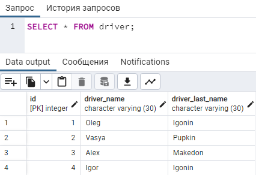
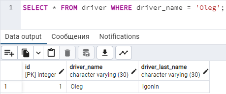
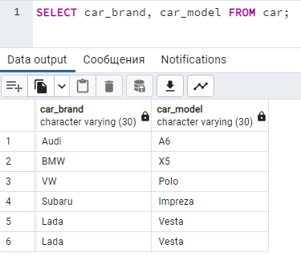
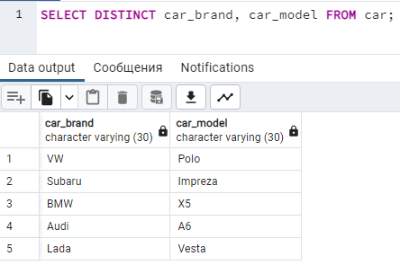
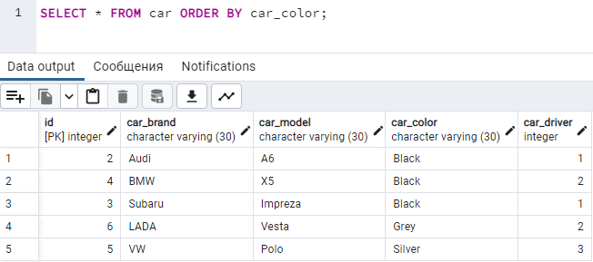
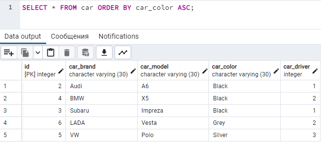
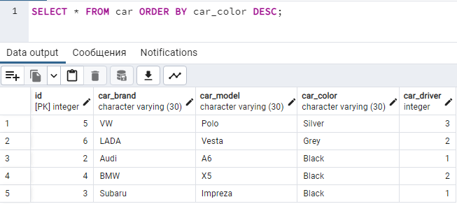
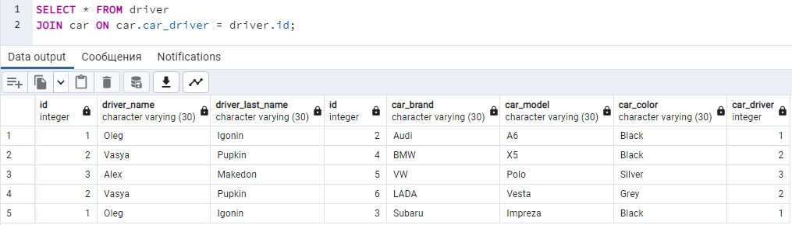
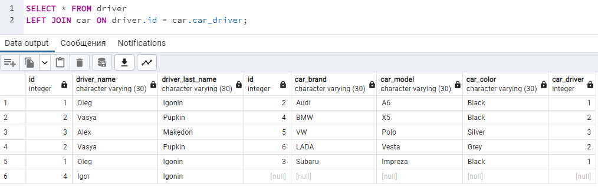
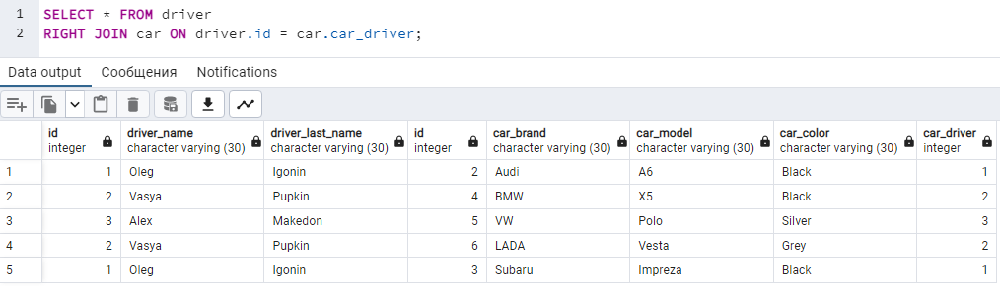

## 2.2 SQL

* **SQL** - Structred Query Language. Язык Структурированных Запросов - язык для взаимодействия с БД.(База Данных)

* **Реляционная База Данных** - это набор данных с предопределенными связями между ними (между таблицами, строками и колонками). Эти данные организованны в виде набора таблиц, состоящих из столбцов и строк. В таблицах хранится информация об объектах, представленных в базе данных. В каждом столбце таблицы хранится определенный тип данных, в каждой ячейке – значение атрибута. Каждая строка таблицы представляет собой набор связанных значений, относящихся к одному объекту или сущности. Каждая строка в таблице может быть помечена уникальным идентификатором, называемым **первичным ключом**, а строки из нескольких таблиц могут быть связаны с помощью внешних ключей. К этим данным можно получить доступ многими способами, и при этом реорганизовывать таблицы БД не требуется.


* **Таблица** - это совокупность связанных данных, хранящихся в структурированном виде. Имеет столбцы (колонки) и строки (записи или кортежи)

* **Столбец** - набор значений данных одного типа в таблице. (их еще называют полями или атрибутами)

* **Строка** - конкретная запись (кортеж)

* **СУБД** - Система Управления Базами Данных. MySQL, MS SQL, **PostgreSQL**, OracleSQL.

* **Первичный ключ (PRIMARY KEY)** - это поле или поля, которые однозначно определяют запись.

### CREATE TABLE
* **CREATE TABLE** - создание таблицы В базе данных

```SQL
#Cинтаксис
CREATE TABLE НАИМЕНОВАНИЕ_ТАБЛИЦЫ (
	НАИМЕНОВАНИЕ_СТОЛБЦА1 ТИП_ДАННЫХ1 АТРИБУТЫ1,
	НАИМЕНОВАНИЕ_СТОЛБЦА2 ТИП_ДАННЫХ2 АТРИБУТЫ2,
	НАИМЕНОВАНИЕ_СТОЛБЦА3 ТИП_ДАННЫХ3 АТРИБУТЫ3
);

#Пример:
CREATE TABLE car
(
    id    SERIAL PRIMARY KEY,
    brand VARCHAR(255),
    model VARCHAR(255)
)
```
***

### UNIQUE
* **UNIQUE** - значение поля, у которого стоит ключевое слово **UNIQUE**, должно быть уникально

```SQL
#Cинтаксис
CREATE TABLE НАИМЕНОВАНИЕ_ТАБЛИЦЫ (
	НАИМЕНОВАНИЕ_СТОЛБЦА1 ТИП_ДАННЫХ1 UNIQUE
); #Теперь в столбце1 можно положить только уникальные значения
    
#Пример:
CREATE TABLE car
(
    id    SERIAL PRIMARY KEY,
    brand VARCHAR(255),
    model VARCHAR(255),
    vin VARCHAR(255) UNIQUE
); #vin - уникальная колонка, в которой будут храниться только уникальные записи, т.е. дубликатов не будет
```
***

### PRIMARY KEY

* **PRIMARY KEY** - это отдельное поле или комбинация полей, которые однозначно определяют запись
```SQL
id SERIAL PRIMARY KEY;
```
***

### INSERT INTO

* **INSERT INTO** - добавление записи в таблицу
```SQL
#Cинтаксис
INSERT INTO НАИМЕНОВАНИЕ_ТАБЛИЦЫ VALUES(ЗНАЧЕНИЯ); #Формат, когда мы заполняемя все поля. Нам нужно знать, в каком порядке идет каждое поле
INSERT INTO НАИМЕНОВАНИЕ_ТАБЛИЦЫ(НАИМЕНОВАНИЕ_СТОЛБЦА1, НАИМЕНОВАНИЕ_СТОЛБЦА2 и.т.д) VALUES(ЗНАЧЕНИЕ_ДЛЯ_СТОЛБЦА1, ЗНАЧЕНИЕ_ДЛЯ_СТОЛБЦА2); #Формат, когда мы хотим заполнить определенные поля
    
#Пример:
INSERT INTO car(brand, model) VALUES ("Audi", "A6"); #В таблицу car добавили новую строку со значениями (brand="Audi", model="A6")
```
***

### SELECT

* **SELECT** - выборка данных из определенных таблиц
```SQL
#Cинтаксис
SELECT КОЛОНКА1, КОЛОНКА2 ... КОЛОНКАN FROM НАИМЕНОВАНИЕ ТАБЛИЦЫ;
SELECT * FROM НАИМЕНОВАНИЕ ТАБЛИЦЫ; #'*' - указывает, что нужно вернуть информацию по всем колонкам

#Пример:
SELECT * FROM car; #Запрос всей таблицы Car. Т.е. запрос вернет абсолютно всю информацию, которая хранится в таблице car
SELECT brand, model FROM car; #Запрос вернет все данные, хранящиеся в колонках "brand" и "model" из таблицы Car
```

#### SELECT

***

### WHERE

* **WHERE** - ключевое слово для создания условия в запросе
```SQL
#Синтаксис
SELECT НАИМЕНОВАНИЕ_СТОЛБЦОВ FROM НАИМЕНОВАНИЕ_ТАБЛИЦЫ WHERE УСЛОВИЕ_ЗАПРОСА; #Результатом запроса будут те данные, которые подходили под условие
                                                       
#Пример:
SELECT brand, model FROM car WHERE color != "Black"; #Результатом запроса будут машины, чей цвет не черный
SELECT * FROM car WHERE id = 3; #Результатом запроса будет одна машина, у которой id равен 3
```
#### Без применения WHERE


#### С применением WHERE

***

***

### UPDATE и SET

* **UPDATE** - обновление данных в таблице
* **SET** - установка нового значения

```SQL
#Синтаксис
UPDATE НАИМЕНОВАНИЕ_ТАБЛИЦЫ SET НАИМЕНОВАНИЕ_КОЛОНКИ = НОВОЕ_ЗНАЧЕНИЕ_В_КОЛОНКЕ; #Во всех строках по НАИМЕНОВАНИЕ_КОЛОНКИ значение изменится
UPDATE НАИМЕНОВАНИЕ_ТАБЛИЦЫ SET НАИМЕНОВАНИЕ_КОЛОНКИ = НОВОЕ_ЗНАЧЕНИЕ_В_КОЛОНКЕ WHERE НАИМЕНОВАНИЕ_КОЛОНКИ = СТАРОЕ_ЗНАЧЕНИЕ; #Во всех строках где значение по НАИМЕНОВАНИИ_КОЛОНКИ было равно СТАРОЕ_ЗНАЧЕНИЕ, изменится на НОВОЕ_ЗНАЧЕНИЕ

#Пример:
UPDATE car SET color = "BLack"; #У всех машин теперь цвет - черный
UPDATE сar SET coloe = "White" WHERE brand = "Audi"; #У всех машин, которые являются Audi (brand = "Audi"), цвет изменится на белый
```
***

### DELETE
* **DELETE** - удаление строк из таблицы
```SQL
#Синтаксис:
DELETE FROM НАИМЕНОВАНИЕ_ТАБЛИЦЫ; #Очистка всей таблицы
DELETE FROM НАИМЕНОВАНИЕ_ТАБЛИЦЫ WHERE УСЛОВИЕ; #Удаляет строки, которые подходят по условию
    
#Пример:
DELETE FROM car; #Удаление всех данных из таблицы car
DELETE FROM car WHERE brand = "VW"; #Удаление всех строк, где brand = VW, из таблицы car
```
***

### DISTINCT
* **DISTINCT** - уборка дубликатов из результата запроса
```SQL
#Синтаксис:
SELECT DISTINCT * FROM НАИМЕНОВАНИЕ_ТАБЛИЦЫ; #Вернет только уникальные строки (без дубликатов) 
    
#Пример:
SELECT DISTINCT * FROM car; #Вернет все машины, без повторений
```
#### Без применения DISTINCT


#### С применением DISTINCT

***

### ORDER BY
* **ORDER BY** - сортировка результата запроса
  * **ASC** - по умолчанию сортировка идет от меньшего к большему
  * **DESC** - сортировка идет от большего к меньшему
```SQL
#Синтаксис:
SELECT * FROM НАИМЕНОВАНИЕ_ТАБЛИЦЫ ORDER BY КОЛОНКА_ПО_КОТОРОЙ_НУЖНО_ОТСОРТИРОВАТЬ; #Результат запроса будет отсортирован от меньшего к большему (потому что по умолчанию стоит ASC) по колонке, указанной после ORDER BY. Сортировать можно по нескольким колонкам.
SELECT * FROM НАИМЕНОВАНИЕ_ТАБЛИЦЫ ORDER BY КОЛОНКА_ПО_КОТОРОЙ_НУЖНО_ОТСОРТИРОВАТЬ DESC; #Результат запроса будет отсортирован от большего к меньшему (потому что поставили DESC) по колонке, указанной после ORDER BY.
    
#Пример:
SELECT * FROM car ORDER BY color; #Результат запроса будет отсортирован по колонке color. От меньшего к большему
SELECT * FROM car ORDER BY color DESC; #Результат запроса будет отсортирован по колонке color. От большего к меньшему
```
#### ORDER BY без ASC


#### ORDER BY с применением ASC


Ничего не изменилось, потому что по умолчанию группировка идет ASC, поэтому его не обязательно добавлять

#### ORDER BY с применением DESC

***

### JOIN
* **JOIN** - присоединение таблицы. Есть несколько **JOIN**`ов:
    * **OUTER JOIN** - внешнее присоединение. Есть **LEFT JOIN** и **RIGHT JOIN**. Разница между ними в том, какая таблица будет взята за основу. Если **LEFT JOIN** то за основу будет взята таблица, которая указана перед **JOIN**. Именно к ее строкам будут присоединять строки другой таблицы по какому либо условию. Если будет **RIGHT JOIN**, то за основу будет взята таблица, которая указана после слова **JOIN**. Та таблица, которая взята за основу будет выведена полностью (т.е. все строки попадут в результат, если нет какого либо условия **WHERE**).
    * **INNER JOIN** - внутреннее присоединение (Ключевое слово INNER не обязательно). Будут выведены все строки, которые подходят по условию
* **ON** - условие при присоединении
```SQL
#Синтаксис:
SELECT * FROM НАИМЕНОВАНИЕ_ТАБЛИЦЫ1 JOIN НАИМЕНОВАНИЕ_ТАБЛИЦЫ2 ON УСЛОВИЕ_ПРИСОЕДИНЕНИЯ_ТАБЛИЦ; #Результатом будут все строки, которые подошли под условие. 
SELECT * FROM НАИМЕНОВАНИЕ_ТАБЛИЦЫ1 LEFT JOIN НАИМЕНОВАНИЕ_ТАБЛИЦЫ2 ON УСЛОВИЕ_ПРИСОЕДИНЕНИЯ_ТАБЛИЦ; #Результатом будут все строки, которые подошли под условие. За основу взята ТАБЛИЦА1 и к ней идет присоединение ТАБЛИЦА2.
SELECT * FROM НАИМЕНОВАНИЕ_ТАБЛИЦЫ1 RIGHT JOIN НАИМЕНОВАНИЕ_ТАБЛИЦЫ2 ON УСЛОВИЕ_ПРИСОЕДИНЕНИЯ_ТАБЛИЦ; #Результатом будут все строки, которые подошли под условие. За основу взята ТАБЛИЦА2 и к ней идет присоединение ТАБЛИЦА1.

#Пример:
SELECT * FROM driver JOIN car ON driver.id = car.car_driver; #Результатом будут все строки подошедшие под условие
SELECT * FROM driver LEFT JOIN car ON driver.id = car.car_driver; #Результатом будут все строки подошедшие под условие
SELECT * FROM driver RIGHT JOIN car ON driver.id = car.car_driver; #Результатом будут все строки подошедшие под условие
```
#### INNER JOIN


#### LEFT JOIN


#### RIGHT JOIN
