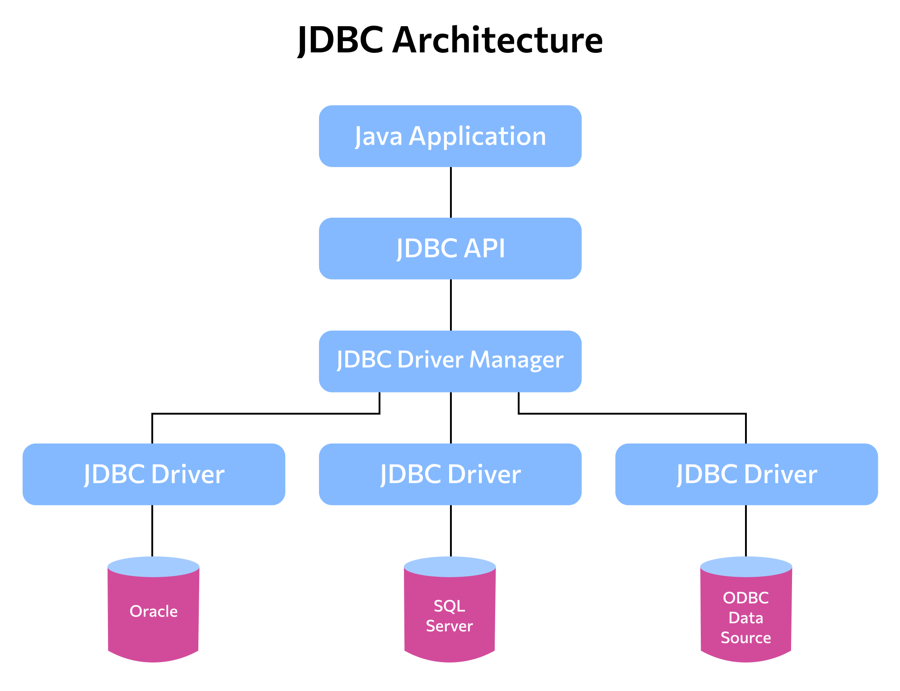

## 2.3 JDBC

* **JDBC/Java DataBase Connectivity** -  это платформенно независимый промышленный стандарт взаимодействия Java-приложений с реляционными базами данных. Предназначен для взаимодействия Java-приложения с различными системами управления базами данных (СУБД).



> JDBC служит адаптером (прослойкой) между нашим приложением и самой базой данных. Под каждую СУБД свой адаптер

Для подключения JDBC нужно подгрузить нужный нам адаптер:

```XML
<dependencies>
    <!-- https://mvnrepository.com/artifact/org.postgresql/postgresql -->
    <dependency>
        <groupId>org.postgresql</groupId>
        <artifactId>postgresql</artifactId>
        <version>42.5.0</version>
    </dependency>
</dependencies>
```

По скольку JDBC - это адаптер между приложением и БД, то ему нужно указать, с какой БД работать. Можно использовать **DataSource** или **DriverManager**. **DataSource** является более предпочтительным, т.к:

* **DriverManager**
	* Для создания соединения нужно знать всю информацию о БД: адрес, пользователь, пароль 
	* Снижает производительность приложения, поскольку соединения создаются/закрываются в классах Java.
	* Не поддерживает пул соединений.

* **DataSource**
	* Повышает производительность приложения, поскольку соединения не создаются/закрываются внутри класса, они управляются сервером приложений и могут быть извлечены во время выполнения.
	* Предоставляет возможность создания пула соединений

Создаем подключение (создаем мост, между нашим приложением с одной стороны и БД с другой)

```JAVA
//Через DriverManager
Connection driverManagerConnection = DriverManager.getConnection("jdbc:postgresql://localhost:5432/lesson_sql",
                "postgres",
                "password");
//Через DataSource
DataSource dataSource = new PGSimpleDataSource(); //PGSimpleDataSource - для работы с PostgreSQL
Connection dataSourceConnection = dataSource.getConnection("postgres", "password");
```


### Statement, PreparedStatement

* **Statement** - используется для выполнения статического оператора SQL и возврата полученных результатов.

* **PreparedStatement** - представляет предварительно скомпилированный оператор SQL (защита от SQL-инъекций + многократное использование).

* **SQL-инъекция** - атака на базу данных. Изменение действия скрипта путем его редактирования.

Пример:

У нас есть запрос в таблицу **Car**, в котором мы хотим получить все машины, которые есть в таблице:
```JAVA
class Main {
    public static final FIND_ALL = "SELECT * FROM ";
    public static void main(String[] args) {
        Scanner scanner = new Scanner(System.in);
        DataSource dataSource = new PGSimpleDataSource(); 
        Connection dataSourceConnection = dataSource.getConnection("postgres", "password");
        Statement state = dataSourceConnection.createStatement();
        //В table мы записываем название таблицы, из которой хотим все достать
        //Вот здесь, порядочный пользователь должен ввести "car" и будем нам счастье
        //Но если пользователь хочет сломать нам бд, то он может сюда, вместо названия таблицы, вписать свой скрипт
        String table = scanner.nextLine();
        //если было введено "car", то запрос в бд будет таким - "SELECT * FROM car"
        //а если нам хотят сломать бд, то запрос может быть таким
        //"SELECT * FROM car; DROP TABLE car;"
        //Теперь наш запрос состоит из двух подзапросов
        //Первый возвращает нам всю информацию из таблицы "car"
        //Второй запрос удаляет эту таблицу
        ResultSet result = state.executeQuery(FIND_ALL + table);
        dataSourceConnection.close();

    }
}
```

Что бы избежать SQL-инъекции, нужно использовать **PreparedStatement**
```JAVA
class Main {
    public static final FIND_ALL = "SELECT * FROM ";
    public static void main(String[] args) {
        Scanner scanner = new Scanner(System.in);
        DataSource dataSource = new PGSimpleDataSource(); 
        Connection dataSourceConnection = dataSource.getConnection("postgres", "password");
        //В table мы записываем название таблицы, из которой хотим все достать
        //Вот здесь, порядочный пользователь должен ввести "car" и будем нам счастье
        //Но если пользователь хочет сломать нам бд, то он может сюда, вместо названия таблицы, вписать свой скрипт
        String table = scanner.nextLine();
        PreparedStatement state = dataSourceConnection.preparedStatement(FIND_ALL + table); 
        ResultSet result = state.executeQuery();
        dataSourceConnection.close();
    }
}
```

**Connection**, как и любой ресурс, нужно обязательно закрывать, после его использования (если он уже не нужен).
```JAVA
dataSourceConnection.close();
```