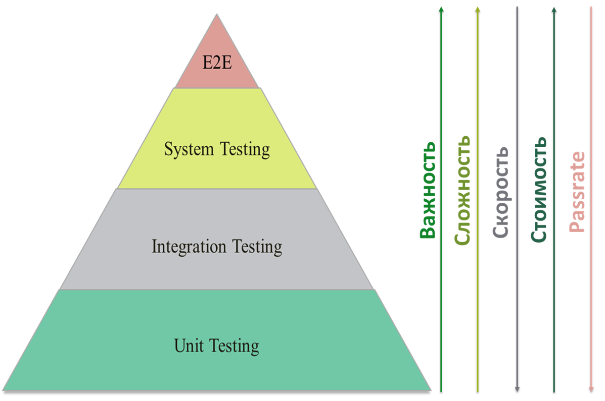
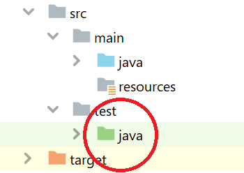

## 2.4 JUnit

Пирамида тестирования, также часто говорят уровни тестирования, это группировка тестов по уровню детализации и их назначению.



* **Unit Testing** - Модульное Тестирование (Юнит тестирование):
На этом уровне тестируют атомарные части кода. Это могут быть классы, функции или методы классов.

* **Integration Testing** - Интеграционное Тестирование:
Проверяет взаимосвязь компонента, которую проверяли на модульном уровне, с другой или другими компонентами, а также интеграцию компонента с системой (проверка работы с ОС, сервисами и службами, базами данных, железом и т.д.).

* **System Testing** - Системное Тестирование:
Проверяет взаимодействие тестируемого ПО с системой по функциональным и нефункциональным требованиям.

* **E2E** - Приемочное Тестирование:
Также часто называют E2E тестами (End-2-End) или сквозными. На этом уровне происходит валидация требований (проверка работы ПО в целом).

Юнит тесты находят ошибки на фундаментальных уровнях, их легче разрабатывать и поддерживать. Важное преимущество модульных тестов в том, что они быстрые и при изменении кода позволяют быстро провести регресс (убедиться, что новый код не сломал старые части кода).

Для Юнит тестирования нужно поключить определенные библиотеки:

* **junit-jupiter-api** - основной модуль, в котором расположены основные аннотации
* **junit-jupiter-engine** - тестовый движок для выполнения тестов
* **junit-jupiter-params** - для параметризации тестов
* **mockito-junit-jupiter** - библиотека (фреймворк), для установки заглушек

```XML
<dependencies>
        <!-- https://mvnrepository.com/artifact/org.junit.jupiter/junit-jupiter-api -->
        <dependency>
            <groupId>org.junit.jupiter</groupId>
            <artifactId>junit-jupiter-api</artifactId>
            <version>5.9.0</version>
            <scope>test</scope>
        </dependency>

        <!-- https://mvnrepository.com/artifact/org.junit.jupiter/junit-jupiter-engine -->
        <dependency>
            <groupId>org.junit.jupiter</groupId>
            <artifactId>junit-jupiter-engine</artifactId>
            <version>5.9.0</version>
            <scope>test</scope>
        </dependency>

        <!-- https://mvnrepository.com/artifact/org.junit.jupiter/junit-jupiter-params -->
        <dependency>
            <groupId>org.junit.jupiter</groupId>
            <artifactId>junit-jupiter-params</artifactId>
            <version>5.9.0</version>
            <scope>test</scope>
        </dependency>

        <!-- https://mvnrepository.com/artifact/org.mockito/mockito-junit-jupiter -->
        <dependency>
            <groupId>org.mockito</groupId>
            <artifactId>mockito-junit-jupiter</artifactId>
            <version>4.7.0</version>
            <scope>test</scope>
        </dependency>

    </dependencies>
```

В проекте есть специальная папка для тестов:



Класс-тест можно создать двумя путями:

* Обычным путем, как создаются классы
* Вызвать в классе, который нужно тестировать, контекстное меню (правой кнопкой мышки) -> выбрать пункт 'Generate...' -> Выбрать 'Test'. 

### Шпаргалка по аннотациям

#### @Test 
Аннотация, указывающая, что данный метод - jUnit-тест.
```JAVA
class SomeClass {

	@Test
	public void someTest() {
		//Блок кода
	}
}
```
***
#### @BeforeEach 
Метод, помеченный данной аннотацией, будет запускаться перед каждым тестовым методом в тестовом классе.
```JAVA
class SomeClass {
	private String someMessage;

	@BeforeEach
	public void setUp(){
		someMessage = "Some Text";
	}

	@Test
	public void someTest() {
		System.out.println(someMessage);
		//Блок кода
	}
}
```
#### @AfterEach  
Метод, помеченный данной аннотацией, будет запускаться после каждого тестового метода в тестовом классе.
```JAVA
class SomeClass {
	private String someMessage;

	@BeforeEach
	public void setUp(){
		someMessage = "Some Text";
	}

	@Test
	public void someTest() {
		System.out.println(someMessage);
		//Блок кода
	}

	@AfterEach
	public void drop(){
		someMessage = null;
	}
}
```
***
#### @BeforeAll
Метод, помеченный данной аннотацией, будет запущен перед всеми методами в тестовом классе. Должен быть статическим.
```JAVA
class SomeClass {

	@BeforeAll
	public static void init() {
		System.out.println("Начинается тестирование");
	}

	@Test
	public void someTest() {
		//Блок кода
	}
}
```
***
#### @AfterAll 
Метод, помеченный данной аннотацией, будет запущен после всех методов в тестовом классе. Должен быть статическим.
```JAVA
class SomeClass {


	@Test
	public void someTest() {
		//Блок кода
	}

	@AfterAll
	public static void end() {
		System.out.println("Тестирование закончилось");
	}
}
```
***
#### @DisplayName 
Используется, для настройки отображаемого имени тестового метода или тестового класса
```JAVA
class SomeClass {

	@Test
	@DisplayName("Тест на простое число")
	public void someTest() {
		//Блок кода
	}
}
```
***
#### @Nested 
Используется, для пометки вложенного тестового класса
```JAVA
class SomeClass {

	@Nested
	class IsSimple {

		@Test
		public void someTest() {
			//Блок кода
		}
	}
}
```
***
#### @ParametrizedTest 
Метод, помеченный данной аннотацией, становится настраиваемым. Нужно указать аргументы, которые будут переданы внутрь метода.
	
* **@ValueSource** - данная аннотация предоставляет методу простые аргументы (примитивы и строки)
```JAVA
class SomeClass {

	@ParametrizedTest
	@ValueSource(ints = {2, 3, 13, 17, 19, 31})
	public void someTest(int number) {
		//Данный тест выполнится 6 раз, каждый раз последовательно подставляя числа. указанные в @ValueSource
		//Блок кода
	}
}
```
* **@ArgumentSource** - данная аннотация предоставляет методу многоразового поставщика аргументов. Класс, который передается в 	качестве аргумента, должен имплементировать интерфейс ArgumentsProvider.
```JAVA
class SomeClass {

	@ParametrizedTest
	@ArgumentSource(value = SomeProvider.class)
	public void someTest(int number) {
		//Блок кода
	}
}
```
* **@CsvSource** - данная аннотация позволяет нам задавать списки аргументов как значения, разделенные запятыми
```JAVA
class SomeClass {

	@ParametrizedTest
	@CsvSource(value = {"9, 12, 3", "18, 12, 6", "16, 48, 16"})
	public void someTest(int number1, int number2, result) {
		//Блок кода
	}
}
```
* **@MethodSource** - данная аннотация предоставляет методу ссылку на другой, фабричный, метод (т.е. результат работы данного метода попадает в тестируемый метод)
```JAVA
class SomeClass {

	@ParametrizedTest
	@MethodSource(value = "someMethods")
	public void someTest(int number) {
		//Блок кода
	}

	public static int someMethods() {
		//блок кода
	}
}
```
***
#### @ExtendWith 
Для регистрации дополнительных расширений
#### @Mock 
Данная аннотация вешается на внешние зависимости класса, поведение которых будет имитироваться.
```JAVA
@ExtendWith(MockitoExtension.class)
class SomeClass {

	@Mock
	private AnotherClass anotherClass;

	//Блок кода
}
```
***
#### @DisplayNameGeneration 
Генерация отображаемых имен
```JAVA
@DisplayNameGeneration(value = DisplayNameGenerator.ReplaceUnderscores.class)
class SomeClass {
	//Блок кода
}
```
***


### Assertions

Утверждения нужны для сравнения ожидаемого результата с фактическим результатом, который выдал нам метод.

#### assertEquals() 
Используется для подтверждения того, что ожидаемое и фактическое значения равны. 

> Синтаксис:\
> **assertEquals(ТО_ЧТО_ОЖИДАЕМ, ТО_ЧТО_ПОЛУЧИЛИ_ПО_ФАКТУ)**\
> **assertEquals(ТО_ЧТО_ОЖИДАЕМ, ТО_ЧТО_ПОЛУЧИЛИ_ПО_ФАКТУ, СООБЩЕНИЕ_В_СЛУЧАЕ_ПРОВАЛА_ТЕСТА)**

Пример:
```JAVA
class NumberUtilTest {

	private final NumberUtil numberUtil = new NumberUtil();

	//тест пройдет
	public void testIsSimple1() {
		assertEquals(true, numberUtil.isSimple(7));
	}

	//тест провалится
	public void testIsSimple2() {
		assertEquals(true, numberUtil.isSimple(6));
	}

	//тест провалится и выведется сообщение
	public void testIsSimple3() {
		assertEquals(true, numberUtil.isSimple(6), "Тест провален. Полученное число - не простое");
	}
}
```
***
#### assertNotEquals() 
Используется для подтверждения того, что ожидаемое и фактическое значения не равны.
> Синтаксис:\
> **assertNotEquals(ТО_ЧТО_ОЖИДАЕМ, ТО_ЧТО_ПОЛУЧИЛИ_ПО_ФАКТУ)**\
> **assertNotEquals(ТО_ЧТО_ОЖИДАЕМ, ТО_ЧТО_ПОЛУЧИЛИ_ПО_ФАКТУ, СООБЩЕНИЕ_В_СЛУЧАЕ_ПРОВАЛА_ТЕСТА)**

Пример:
```JAVA
class NumberUtilTest {

	private final NumberUtil numberUtil = new NumberUtil();

	//тест пройдет
	public void testIsSimple1() {
		assertNotEquals(true, numberUtil.isSimple(6));
	}

	//тест провалится
	public void testIsSimple2() {
		assertNotEquals(true, numberUtil.isSimple(7));
	}

	//тест провалится и выведется сообщение
	public void testIsSimple3() {
		assertNotEquals(true, numberUtil.isSimple(7), "Тест провален. Полученное число - простое");
	}
}
```
***
#### assertTrue()
Утверждение, что переданное условие истинно
> Синтаксис:\
> **assertTrue(ТО_ЧТО_ПОЛУЧИЛИ_ПО_ФАКТУ)**\
> **assertTrue(ТО_ЧТО_ПОЛУЧИЛИ_ПО_ФАКТУ, СООБЩЕНИЕ_В_СЛУЧАЕ_ПРОВАЛА_ТЕСТА)**

Пример:
```JAVA
class NumberUtilTest {

	private final NumberUtil numberUtil = new NumberUtil();

	//тест пройдет
	public void testIsSimple1() {
		assertTrue(numberUtil.isSimple(7));
	}

	//тест провалится
	public void testIsSimple2() {
		assertTrue(numberUtil.isSimple(6));
	}

	//тест провалится и выведется сообщение
	public void testIsSimple3() {
		assertTrue(numberUtil.isSimple(6), "Тест провален. Полученное число - не простое");
	}
}
```
***
#### assertFalse() 
Утверждение, что переданное условие ложно
> Синтаксис:\
> **assertFalse(ТО_ЧТО_ПОЛУЧИЛИ_ПО_ФАКТУ)**\
> **assertFalse(ТО_ЧТО_ПОЛУЧИЛИ_ПО_ФАКТУ, СООБЩЕНИЕ_В_СЛУЧАЕ_ПРОВАЛА_ТЕСТА)**

Пример:
```JAVA
class NumberUtilTest {

	private final NumberUtil numberUtil = new NumberUtil();

	//тест пройдет
	public void testIsSimple1() {
		assertFalse(numberUtil.isSimple(6));
	}

	//тест провалится
	public void testIsSimple2() {
		assertFalse(numberUtil.isSimple(7));
	}

	//тест провалится и выведется сообщение
	public void testIsSimple3() {
		assertFalse(numberUtil.isSimple(7), "Тест провален. Полученное число - простое");
	}
}
```
***
#### assertNull() 
Утверждение, что переданное значение является 'null'
> Синтаксис:\
> **assertNull(ОБЪЕКТ)**\
> **assertNull(ОБЪЕКТ, СООБЩЕНИЕ_В_СЛУЧАЕ_ПРОВАЛА_ТЕСТА)**

Пример:
```JAVA
class AnotherClassTest {

	//тест пройдет
	public void testIsNull1() {
		String string = null;
		assertNull(string);
	}

	//тест провалится
	public void testIsNull2() {
		String string = "Not null";
		assertNull(string);
	}

	//тест провалится и выведется сообщение
	public void testIsNull3() {
		String string = "Not null";
		assertNull(string, "Тест провален");
	}
}
```
***
#### assertNotNull() 
Утверждение, что переданное значение не является 'null'
> Синтаксис:\
> **assertNotNull(ОБЪЕКТ)**\
> **assertNotNull(ОБЪЕКТ, СООБЩЕНИЕ_В_СЛУЧАЕ_ПРОВАЛА_ТЕСТА)**

Пример:
```JAVA
class AnotherClassTest {

	//тест пройдет
	public void testIsNotNull1() {
		String string = "Not null";
		assertNotNull(string);
	}

	//тест провалится
	public void testIsNotNull2() {
		String string = null;
		assertNotNull(string);
	}

	//тест провалится и выведется сообщение
	public void testIsNull3() {
		String string = null;
		assertNotNull(string, "Тест провален");
	}
}
```
***